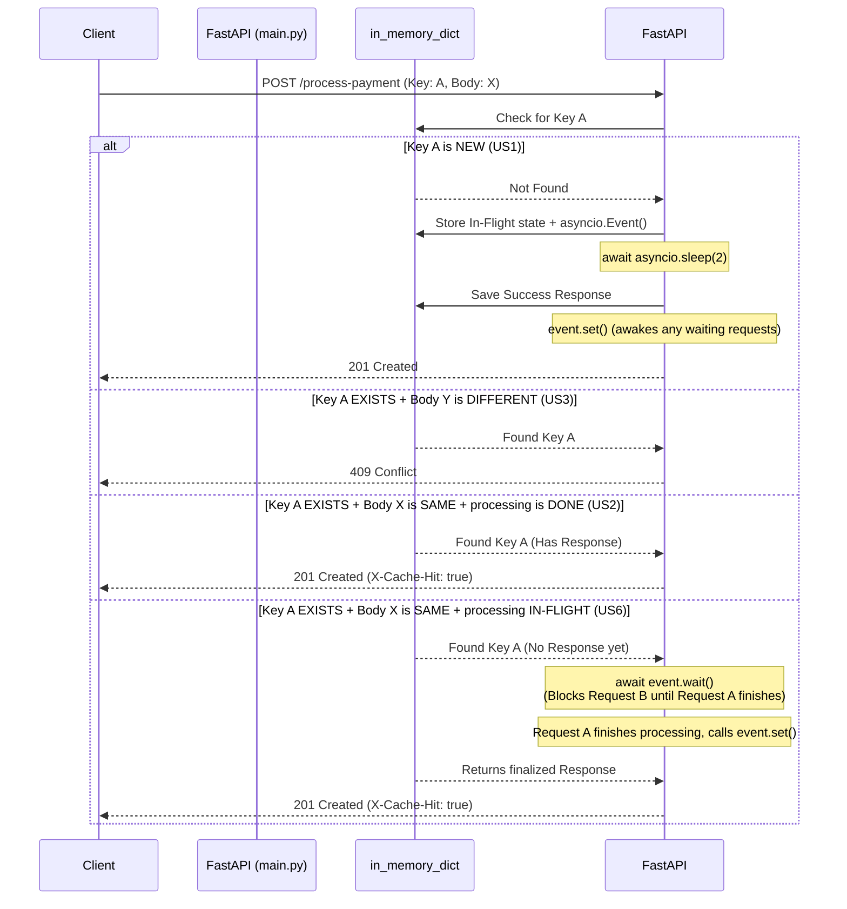

# Idempotency-Gateway

A lightweight, zero-dependency (other than FastAPI/Uvicorn) gateway application demonstrating handling of idempotent API requests, handling concurrent race conditions, and basic memory management. Built for the FinSafe backend challenge.

## Features Implemented
- **US1 (Happy Path)**: Processes payments with a simulated 2-second delay.
- **US2 (Duplicate)**: Returns cached responses immediately with an `X-Cache-Hit: true` header.
- **US3 (Conflict)**: Returns a `409 Conflict` if the same `Idempotency-Key` is reused with a different request payload.
- **US6 (In-Flight / Race Condition)**: Uses `asyncio.Event` to safely block duplicate requests if the original request with the same key is still processing. 
- **US7 (Developer's Choice - Expiry)**: Implements a background task to automatically clean up idempotency keys older than 24 hours to prevent memory leaks.

## Setup and Run Instructions

### Prerequisites
- Python 3.8+

### Installation
1. Clone the repository and navigate to the project directory:
   ```bash
   cd Idempotency-Gateway
   ```
2. Create and activate a virtual environment:
   ```bash
   python -m venv venv
   # On Windows:
   venv\Scripts\activate
   # On macOS/Linux:
   source venv/bin/activate
   ```
3. Install the dependencies:
   ```bash
   pip install -r requirements.txt
   ```

### Running the Server
Start the FastAPI server using Uvicorn:
```bash
uvicorn main:app --reload
```
The API will be available at `http://localhost:8000`. You can also view the interactive Swagger documentation at `http://localhost:8000/docs`.

## API Documentation

### `POST /process-payment`

Processes a payment idempotently.

**Headers:**
- `Idempotency-Key` (required): A unique string identifying the specific request intent (e.g., a UUID).

**Body (JSON):**
```json
{
  "amount": 100.50,
  "currency": "USD"
}
```

### cURL Examples

**1. US1: Happy Path (New Request)**
```bash
curl -X POST http://localhost:8000/process-payment \
  -H "Content-Type: application/json" \
  -H "Idempotency-Key: key-123" \
  -d "{\"amount\": 50.0, \"currency\": \"USD\"}" -v
```
*(Takes 2 seconds to respond, returns 201 Created)*

**2. US2: Duplicate Request (Cache Hit)**
```bash
curl -X POST http://localhost:8000/process-payment \
  -H "Content-Type: application/json" \
  -H "Idempotency-Key: key-123" \
  -d "{\"amount\": 50.0, \"currency\": \"USD\"}" -v
```
*(Responds instantly, returns 201 Created, includes `x-cache-hit: true` header)*

**3. US3: Conflict (Same Key, Different Payload)**
```bash
curl -X POST http://localhost:8000/process-payment \
  -H "Content-Type: application/json" \
  -H "Idempotency-Key: key-123" \
  -d "{\"amount\": 99.0, \"currency\": \"EUR\"}" -v
```
*(Responds instantly, returns 409 Conflict)*

## Design Decisions

1. **In-Memory Storage (`dict`)**: Chosen per requirements to keep the architecture simple and eliminate external dependencies like Redis or Postgres. Perfect for a single-instance application or technical demonstration.
2. **`asyncio` for Concurrency**: FastAPI runs asynchronously. Using standard `time.sleep()` would block the entire server thread, ruining concurrency. Using `asyncio.sleep(2)` allows the server to handle other requests while "processing" the payment. 

## Developer's Choice: Key Expiry (Memory Management)

In-memory dictionaries will grow infinitely as new `Idempotency-Key`s are received, eventually causing an Out-Of-Memory (OOM) crash in a production environment. To solve this, I implemented an asynchronous background task (`cleanup_expired_keys`) that starts when the application launches (`@app.on_event("startup")`).

Every hour, it scans the `idempotency_store` and removes any keys created more than 24 hours ago. This guarantees that old keys are naturally garbage-collected, preventing a memory leak while remaining pure Python library code without the need for periodic cron tasks or tools like Redis TTLs.

## Sequence Diagram: Idempotency Logic Flow



## Explaining `asyncio.Event()` for Interviews

The requirement to handle an "In-Flight" race condition (US6) means handling the split-second when Request B arrives before Request A has actually finished processing. 

If Request B blindly returns what is in the cache, it will return nothing (because Request A hasn't saved the answer yet!). If Request B processes the payment again, we double-charge the client.

**How `asyncio.Event()` solves this:**
An `asyncio.Event` acts like a traffic light. 
1. When Request A starts, it creates a red light (`asyncio.Event()`) and places it in the cache under that key.
2. Request B arrives, sees the red light, and stops (`await event.wait()`). It yields control back to the server so the server isn't blocked.
3. Once Request A finishes processing and saves the final response, it turns the light green (`event.set()`).
4. Instantly, Request B sees the green light, wakes up, grabs the newly saved response from the cache, and returns it to the user.
